# 机器学习纳米学位
##毕业项目
 赵鹏举

2017年5月23日

## Rossmann药店销售额预测

## I. 问题的定义

### 项目概述

本项目来自Kaggle比赛[Rossman Store Sales【1】](https://www.kaggle.com/c/rossmann-store-sales#description).  截至2015年，Rossmann在欧洲7个国家运行着超过3000家连锁药店，这些药店的营收会受到促销、竞争者、国家/学校假期、季节、地域等因素的影响。Rossmann希望参加比赛项目的选手，可以准确地预测出位于德国1115家药店在六周内每天的销售情况；进而利用可靠的销售预测情况帮助药店经理制定更加高效的工作安排。

本项目中，相关数据包含 train.csv、store.csv和test.csv：

- train.csv是历史销售数据，每条信息包含了药店编号、日期、星期几、是否营业、是否节假日、是否促销、当日销售额以及客户数量；
- store.csv是药店数据，每条信息包含了药店编号、药店类型、商品组合、最近竞争者距离及开店时间、促销有无、促销间隔和开始时间。
- test.csv是用来预测的信息，每条信息包含了编号Id、药店编号、星期几、日期、是否营业、是否节假日、是否促销；

输入的数据对于药店销售预测是非常有用的：日期和星期几等可以提供销售额周期性的时间标定；是否节假日和促销，以及每家药店的信息和竞争者的信息，对于销售额也会有一定影响。

销售预测对于每一个企业来说都非常重要，在这一领域，机器学习方法已经得到了广泛且重要的应用，因此通过完成本项目过程中，可以锻炼掌握机器学习的常用方法和工作流程，为从事数据分析工作做准备。销售额预测属于机器学习中有**监督学习**的回归问题，可以采用线性模型、决策树、SVM、神经网络、集成学习等方法进行建模和预测【2】。

为了训练模型，一般需要将数据集划分为训练集、验证集和测试集：

- 训练集：按照日期Date进行划分，train.csv从2013-01-01到2015-06-14的数据
- 验证集：按照日期Date进行划分，train.csv从2015-06-14到2015-07-31的数据
- 测试集：test.csv的数据（从2015-08-01到2015-09-12）。
- 训练集、验证集和测试集均应包含store.csv的数据；

### 问题陈述
本问题属于有监督机器学习中的回归问题：已知1115家药店的信息以及每家药店在2年多时间内每天的销售情况，需要对接下来6周内每家药店的销售状况进行预测。回归问题的常见机器学习方法有K近邻学习、线性回归、决策树、随机森林、XGBoost【3】、神经网络等；而实际中，为了训练出效果较好的模型，一般需要根据数据集的特点，进行特征工程，构造出有用的新特征，并对特征进行选择，同时注意防止过拟合。

本项目将采用XGBoost方法；XGBoost模型是一种有监督的集成学习方法，可以直观理解为对决策树的集成，是非常有效的解决非结构化数据的方法，在Kaggle比赛中得到广泛的应用；比赛过程中，第一名[Gert【4】](https://kaggle2.blob.core.windows.net/forum-message-attachments/102102/3454/Rossmann_nr1_doc.pdf)在原有数据集基础上，构造出临近信息、时间信息、趋势信息等特征，并采用XGBoost方法训练模型；

在本问题提供的数据集中，销售数据作为标记值，其他属性作为特征，对选择的模型进行训练；模型的预测销售数据与标记销售数据之间的差异可以用来对模型进行评估；训练好的模型，对测试数据的预测是可以再现的。

### 评价指标
本项目采用Kaggle比赛【1】的评估指标：RMSPE（误差百分比的均方差），可表示为
$$
RMSPE= \sqrt{\frac{1}{n}\sum_{i=1}^{n}(\frac{y_i-\hat{y_i}}{y_i})^2}
$$
其中，任何当天销售额为0的数据在评估时将被忽略； y_i 表示某药店在某天的实际销售额，而$\hat{y_i}$ 表示该药店在对应这一天的预测销售额。该评价指标的取值范围取$[0,+\infty)$，数值越小表示结果越好。

该评价指标非常合理：

- 误差百分比相对于误差值更为合理，可以避免某些误差值数值较大导致所占比重过大
- 将实际销售额为0的数据剔除出去，避免过度预测（数据缺省导致无法判断该店当天是否营业，保险起见也对当天销售额进行预测）对结果的影响


此外，测试集的销售额数据未知，所以需要提交到Kaggle【1】获取相应预测结果的RMSPE的评分。

## II. 分析
### 数据的探索
####  文件train.csv和store.csv探索
本项目中将会使用 train.csv和store.csv两个文件。

train.csv包含了1115家药店从2013-01-01到2015-07-01合计1017209条销售数据，其中每条销售数据的列名、类型、及其意义为：

| 列名            | 数据类型   | 意义                                       |
| :------------ | :----- | :--------------------------------------- |
| Store         | int64  | 药店编号，从1到1115                             |
| DayOfWeek     | int64  | 星期几，从1到7                                 |
| Date          | object | 日期的字符串形式，从2013-01-01到2015-07-31          |
| Sales         | int64  | 当日该店销售额，非负数；不营业时（即Open为0）为0              |
| Customers     | int64  | 当日该店客户数，非负数；不营业时（即Open为0）为0              |
| Open          | int64  | 当日该店是否营业，是为1，否为0；                        |
| Promo         | int64  | 当日该店是否参与促销Promo，是为1，否为0；                 |
| StateHoliday  | object | 用字符串表示类型，当日该店是否为StateHoliday，是可能为'a' 、'b'、 'c'，否为'0' |
| SchoolHoliday | int64  | 当日该店是否为SchoolHoliday，是为1，否为0；            |

store.csv包含了1115家药店各自的信息，其中每条药店信息的列名、类型、及其意义为：

| 列名                        | 数据类型    | 意义                                       |
| :------------------------ | :------ | :--------------------------------------- |
| Store                     | int64   | 药店编号，从1到1115；与train.csv中Store意义一样        |
| StoreType                 | object  | 表示药店某种类型划分，可选值为字符'a'、 'b'、'c'、 'd'四者之一   |
| Assortment                | object  | 表示药店某种类型划分，可选值为字符'a'、 'b'、'c'三者之一        |
| CompetitionDistance       | float64 | 有缺省值，表示距离最近竞争者到该药店的距离                    |
| CompetitionOpenSinceMonth | float64 | 有缺省值，表示竞争者开始营业的月份                        |
| CompetitionOpenSinceYear  | float64 | 有缺省值，表示竞争者开始营业的年份                        |
| Promo2                    | int64   | 该药店是否参与促销活动Promo2                        |
| Promo2SinceWeek           | float64 | 有缺省值，该药店参与促销活动Promo2的起始周                 |
| Promo2SinceYear           | float64 | 有缺省值，该药店参与促销活动Promo2的起始年                 |
| PromoInterval             | object  | 有缺省值，该药店参与促销活动Promo2的月份，可选值为'Jan,Apr,Jul,Oct' ， 'Feb,May,Aug,Nov' ，'Mar,Jun,Sept,Dec'三者之一 |

### 探索性可视化

销售额Sales是需要进行预测的特征，因其特别重要，所以首先对其进行可视化分析:

- 通过销售额的柱状图和箱框图可以发现：销售额分布范围大约从0到42000，主要大约集中在4000到8000；
- 通过销售的月份平均图可以发现：销售额在月份尺度上体现出一定的周期性，每年的12月份销售额最高，每年的1-3月份销售最低；
  - 每年12月份销售额最高的原因有可能是
    - 习惯。顾客可能会比较习惯在年尾购买下一年将会用到的药品。
    - 假期。对于欧洲来讲，12月份有圣诞节等假期，部分药店会暂停营业，顾客为了避免因药店关门带来的不便，所以会储备些药品。
  - 每年1-3月份销售额较低的原因有可能是顾客刚刚在12月份刚刚买了较多的药品，暂时还不太需要购买。

| 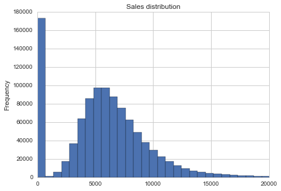 | 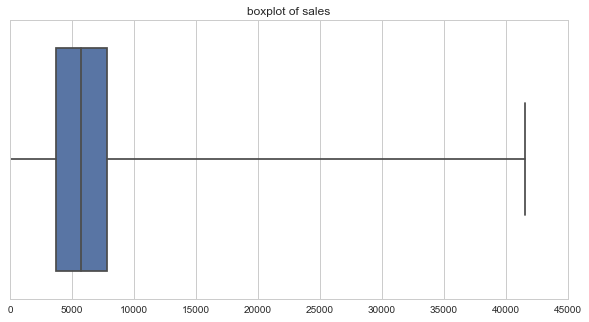 |
| :--------------------------------------: | :--------------------------------------: |
|               销售额Sales的柱状图               |               销售额Sales的箱框图               |

| 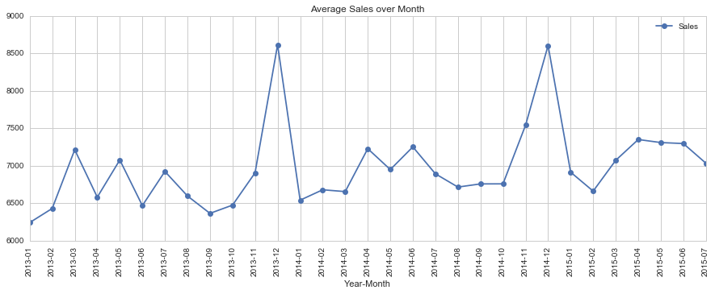 |
| :--------------------------------------: |
|              销售额Sales的月份平均图              |

DayOfWeek、Promo、StateHoliday、SchoolHoliday、StoreType、Assortment等特征与销售额Sales有非常重要的关系，因此将其之间的关系进行可视化：

- DayOfWeek为1和7（即周一和周日）时，销售额较高；
- Promo为1（即进行促销Promo时），销售额较高；
- 处于国家假期StateHoliday（即StateHoliday不为0时）销售额高于非国家假期（即StateHoliday为0时），处于假期b和c时，销售额的平均值（大约10000）比非假期销售额平均值（大约7000）高出30%；
- SchoolHoliday对于销售额的平均值影响不大；
- StoreType为b的药店平均销售额（大约9500）比其他StoreType的药店平均销售额（略低于6000）高出大约50%；
- Assortment为b的平均销售额（大约8000）比其他Assortment的药店平均销售额（大约6000）高出大约30%；

| 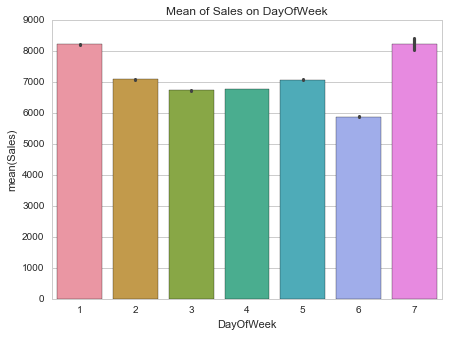 | 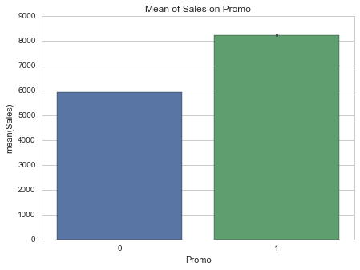 |
| :--------------------------------------: | :--------------------------------------: |
|             DayOfWeek的销售额平均值             |               Promo的销售额平均值               |

| 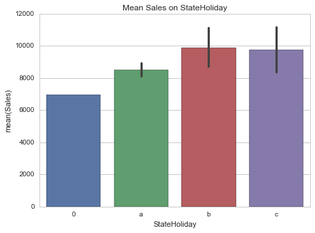 | 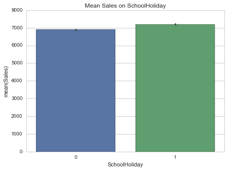 |
| :--------------------------------------: | :--------------------------------------: |
|           StateHoliday的销售额平均值            |           SchoolHoliday的销售额平均值           |

| 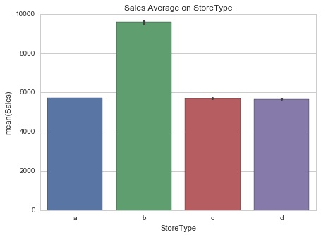 | 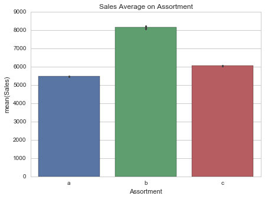 |
| :--------------------------------------: | :--------------------------------------: |
|             StoreType的销售额平均值             |            Assortment的销售额平均值             |

Competition对于销售额也有非常大的影响：

- 以6号药店为例：2013年每月日均销售额范围为5800到7200；而从2013年12月出现竞争者后，2014年每月日均销售额范围为4500到6000，下降非常明显；
- 从CompetitionDistance的KDE分布图可以发现：CompetitionDistance绝大多数分布在0-8000范围内；
- 从CompetitionDistance-Sales的散点图可以发现：CompetitionDistance和Sales绝大多数分布与CompetitionDistance（0，10000），Sales（4000，10000）的范围内。

| 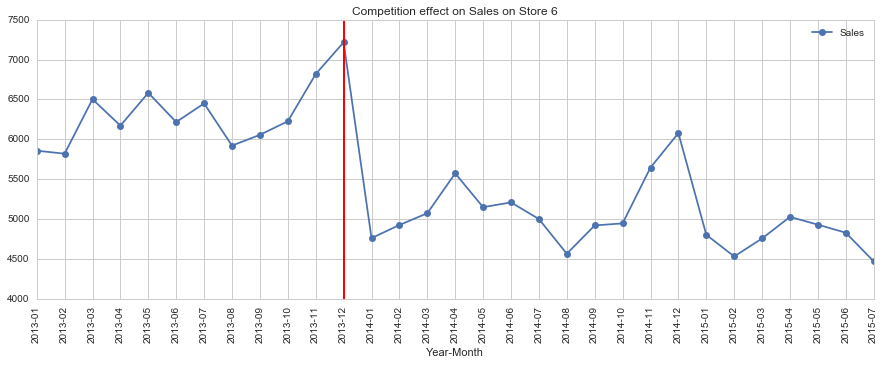 |
| :--------------------------------------: |
|           Competition对6号药店的影响            |

| 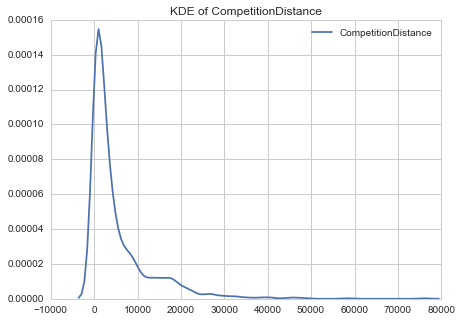 | 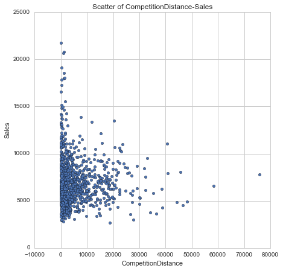 |
| :--------------------------------------: | :--------------------------------------: |
|        CompetitionDistance的KDE分布图        |      CompetitionDistance-Sales的散点图       |

### 算法和技术

本项目训练模型将采用XGBoost方法【3】，该方法是数据挖掘和机器学习中最常用的算法之一，也是从统计学家到数据科学家必备的工具之一，同时也是kaggle比赛冠军选手最常用的工具。因为效果好，计算复杂度不高，也在工业界有大量的应用。

- XGBoost方法是集成学习的一种；集成学习通过构建并结合多个学习器来完成学习任务，而按照个体学习生成器的生成方式，主要分为序列化方法和并行化方法。XGBoost方法是序列化方法代表Boosting的重要算法。 
- Boosting【2】的工作机制是指：从初始训练集中训练一个基学习器，再根据基学习器的表现对训练样本分布进行调整，使得先前基学习器做错的训练样本在后续受到更多关注，然后基于调整后的样本分布来训练下一个基学习器。如此重复直至基学习器训练结束。
- XGBoost方法的基学习器是回归树（CART）【3】。

XGBoost方法对数据的学习能力非常强，在学习过程中比较容易遇到过拟合的问题；为解决[XGBoost的过拟合问题【6】](https://www.analyticsvidhya.com/blog/2016/03/complete-guide-parameter-tuning-xgboost-with-codes-python/)，需要对learning rate学习率、max_depth树最大深度、min_child_weight、subsample、colsample_bytree等参数进行调优；此外，可选不同的特征、random seed训练多个XGBoost模型，然后进行集成，以提高模型性能；

### 基准模型

本项目的基准模型采用具有相同特征参数（Store，DayOfWeek，Promo和InPromo2Today等四个特征）数据子集的中位数；该模型在训练集上的RMSPE数值为**0.225588**，在验证集上的RMSPE数值为**0.140907**；提交到Kaggle官网【1】，可以得到 Public Score为**0.14210** (排名2364，约**71.6%**)，Private Score为**0.14976**(排名2264，约**68.5%**)。

采用该模型作为基准模型，是因为该方法简单有效：

- 模型训练过程非常简单，其核心思路就是创建一个字典dict：从任一特征组合的参数映射到销售额的中位数；而预测过程也非常简单，就是对照训练好的字典dict，找出训练样本所对应参数组合的销售额。
- 该模型之所以有效，是因为对构造模型的特征组合进行了挑选，并用中位数来泛化每一种特征组合（虽然忽略了一些特征）的对应销售额；

## III. 方法
### 数据预处理

#### 类别数据信息处理

- 将train.csv和test.csv中用字符串格式表示的特征StateHoliday的'0','a','b','c'转变为数值0,1,2,3表示的特征StateHoliday_cat；
- 将train.csv和test.csv中用字符串格式表示的特征StoreType的'a','b','c','d'转变为数值0,1,2,3表示的StoreType_cat；
- 将train.csv和test.csv中用字符串格式表示的特征Assortment的'a','b','c'转变为数值0,1,2表示的Assortment_cat；
- 将train.csv和test.csv中用字符串格式表示的特征PromoInterval的'Jan,Apr,Jul,Oct' ， 'Feb,May,Aug,Nov' ，'Mar,Jun,Sept,Dec'转变为相应的月份1/4/7/10，2/5/8/11和3/6/9/12。

#### 时间特征处理

train.csv和test.csv数据的Date为日期的字符串形式，难以直接进行处理，需要先转换为python的标准时间格式datetime；而datetime格式作为一个特征依然比较难以直接处理，所以从中提取为年Year，月Month，日Day三个独立特征；此外，从1月1日算起，当日位于当年第几天DayOfYear作为独立特征提取出来；

#### 竞争Competition相关特征处理

store.csv数据中关于竞争Competition有三个特征CompetitionDistance，CompetitionOpenSinceMonth，CompetitionOpenSinceYear；后两者在是否为缺省值时具有一致性。

- 缺省值
  - 当CompetitionDistance为缺省值时，CompetitionOpenSinceMonth，CompetitionOpenSinceYear亦同时为缺省值，在这种情况下，假定该药店开始竞争的时间为train.csv统计时间结束时（取为2016-01-01），而竞争距离为CompetitionDistance的中位数；
  - 当CompetitionDistance不为缺省值，而CompetitionOpenSinceMonth，CompetitionOpenSinceYear为缺省值时，假定Competition开始时间太早而无法统计到，将其统一设置为CompetitionOpenSinceMonth/Year的最早值1961-01-01。
- 后两者合在一起表示了该店竞争Competition开始的时间，首先取该月份的1日作为该店竞争Competition开始的日期CompetitionSinceDate，进而将该店遇到竞争Competition的天数累积值DaysCountSinceCompetition作为独立特征。
- 对于train.csv和test.csv任一行数据，如果其日期Date在该店的CompetitionSinceDate后，则构建用来表示当天是否处于竞争的特征InCompetitionToday为1，否则为0；

#### 促销Promo2相关特征处理

store.csv中关于促销Promo2有Promo2，Promo2SinceWeek，Promo2SinceYear，PromoInterval等四个特征；当Promo2为0时，后三者为缺省值；

- 缺省值处理
  - Promo2SinceWeek和Promo2SinceYear的缺省值取train.csv统计结束后的某时间（取为2016-01-01）
  - PromoInterval的缺省值替代为''
- Promo2SinceWeek，Promo2SinceYear合在一起表示该店Promo2开始的时间，首先取该周周一作为该店Promo2开始的日期Promo2SinceDate；
- 对于train.csv和test.csv任一行数据，如果其日期Date在该店的Promo2SinceDate之后，且其月份Month在该药店的PromoInterval表示的月份内，则构建用来表示当天是否处于Promo2的特征InPromo2Today为1，否则为0；
- 对于train.csv和test.csv中InPromo2Today为1的数据，可以计算出该店从Promo2SinceDate到当天Dat的天数累积值DaysCountSincePromo2作为独立特征。

#### test.csv中Open特征缺失值的处理

由评估指标 RMSPE（误差百分比的均方差）的定义可知，RMSPE仅与非零Sales有关；同时考虑到所有Open=0时，Sales也为0，那么将Open的缺失值全部设置为1，将不会引入新的误差：
- 如果缺失值对应的实际Sales为零，那么即使预测Sales非零，也不会被计算入RMSPE；
- 如果缺失值对应的实际Sales非零，那么预测Sales将会被计算入RMSPE；对特征Sales、CompetitionDistance、DaysCountSinceCompetition、DaysCountSincePromo2进行对数处理后并取整，得到新特征SalesLog, CompetitionDistance_log，DaysCountSinceCompetition_log和DaysCountSincePromo2_log。经过处理后的数据为离散值，便于进行训练。

#### 特征范围调整

对特征Sales、CompetitionDistance、DaysCountSinceCompetition、DaysCountSincePromo2进行对数处理后并取整，得到新特征SalesLog, CompetitionDistance_log，DaysCountSinceCompetition_log和DaysCountSincePromo2_log。经过处理后的数据为离散值，便于进行训练。

#### Sales数据的异常值处理

对特征Sales进行对数处理得到特征SalesLog；本文采用MAD（median absolute deviation）方法来标记特征SalesLog异常值；注意：训练模型时不使用异常值，但是对数据预测时需要使用异常值。将异常值去掉的作用相当于对数据进行了低通滤波，避免所训练的模型过拟合异常值；当然，这有可能会带来数据信息的丢失。如下图所示10号药店的异常值以红色星号进行标识。

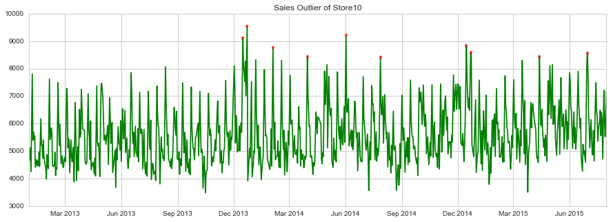

#### Customers数据的处理

虽然train.csv数据提供了特征Customers，但是test.csv没有该Customers特征，因此在选择训练模型时，将抛弃Customers特征。这是因为，即使采用Customers特征的模型有更好的训练效果，但是用来预测Customers全部缺省的测试集，其泛化能力未必会更好。

### 执行过程

- 准备模型的训练数据dtrain、验证数据dvalid、测试数据dtest。

  - 由评价指标的定义可知，训练数据和验证数据的特征Sales应不为0；同时，由于特征Open为0时，Sales也为0，所以训练数据和验证数据的特征Open应不为0；
  - 训练数据和验证数据将会用到的特征feature_x_list包含'Store', 'DayOfWeek', 'Year', 'Month', 'Day', 'DayOfYear', 'StoreType_cat', 'Assortment_cat', 'StateHoliday_cat', 'SchoolHoliday', 'Promo', 'Promo2', 'InPromo2Today', 'DaysCountSinceCompetition_log', 'InCompetition', 'InCompetitionToday', 'CompetitionDistance_log', 'DaysCountSincePromo2_log'等18个特征；

- 构造评估函数rmspe_xg

  - 设置rmspe评估函数，输入值为不为零的销售额及相应销售额预测值

  ```python
  import numpy as np
  def rmspe(y,yhat):
      return np.sqrt(np.mean((yhat/y-1)**2))
  ```

  - 设置rmspe_xg，作为XGBoost模型的评估函数，输入值为不为零的销售额对数值及相应销售额预测值对数值

  ```python
  import numpy as np
  def rmspe_xg(yhat,y):
      y=np.expm1(y.get_label())
      yhat=np.expm1(yhat)
      return 'rmspe',rmspe(y,yhat)
  ```

- 设置模型的watchlist：训练数据dtrain作为训练集，验证数据dvalid作为验证集

  ```python
  watchlist=[(dtrain,'train'),(dvalid,'eval')]
  ```

- 设置模型的固定参数:通过设置seed，可以保证训练模型的可再现性。

  | 固定参数                  | 参数值        |
  | --------------------- | ---------- |
  | seed                  | 42         |
  | 最大训练次数num_boost_round | 20000      |
  | objective             | reg:linear |


- 设置模型初始参数值params；初始参数值选择学习能力较强，训练速度快的参数，对于可能出现的过拟合，将通过后续参数优化进行解决。

  | 需优化参数                         | 初始参数值 | 优化范围            | 初次优化补偿 | 最终优化步长 |
  | ----------------------------- | ----- | --------------- | ------ | ------ |
  | 模型深度max_depth                 | 8     | [3,11]          | 2      | 1      |
  | min_child_weight              | 1     | [1,8]           | 2      | 1      |
  | subsample                     | 0.95  | [0.5,0.95]      | 0.1    | 0.05   |
  | colsample_bytree              | 0.95  | [0.5,0.95]      | 0.1    | 0.05   |
  | 学习率eta                        | 0.3   | [0.05,0.35]     | 0.1    | 0.05   |
  | 提前终止循环次数early_stopping_rounds | 33    | [10/eta,80/eta] | 2倍     | 1.5倍   |

  ​

- 模型在524次训练循环后提前停止，此时训练集上的rmspe值为**0.085322**，验证集上的rmspe值为**0.126617**

```python
import xgboost as xgb
gbm=xgb.train(params,dtrain,num_boost_round,evals=watchlist,early_stopping_rounds=early_stopping_round,feval=rmspe_xg,verbose_eval=True)
```

- 使用训练好的模型对验证集进行预测，预测的rmspe值为**0.126653**

```python
import import xgboost as xgb
import numpy as np
yhat=gbm.predict(xgb.DMatrix(X_valid[feature_x_list]))
error=rmspe(np.exp(y_valid),np.exp(yhat))
```

- 使用训练好的模型对测试集进行预测，将预测好的结果提交到Kaggle，Public Score为**0.12064**(排名1839，约**55.7%**)，Private Score为**0.12894**(排名1596，约**48.3%**)。

### 完善

在项目完成过程中，按照以下方法对模型的参数进行优化：

- 对max_depth和min_child_weight同时进行优化，优化后max_depth选择6，min_child_weight选择5；

  - 优化过程仅考虑模型训练效果；
  - 第一次以较粗的网格进行优化，max_depth可选范围为4,6,8,10，min_child_weight可选范围为2,4,6；通过下方左图发现，max_depth=6，min_child_weight=6时，模型泛化能力最优；
  - 第二次以较细的网格进行优化，max_depth可选范围为5,6,7，min_child_weight可选范围为5,6,7；通过下方右图发现，max_depth=6，min_child_weight=5时，模型泛化能力最优；

  | 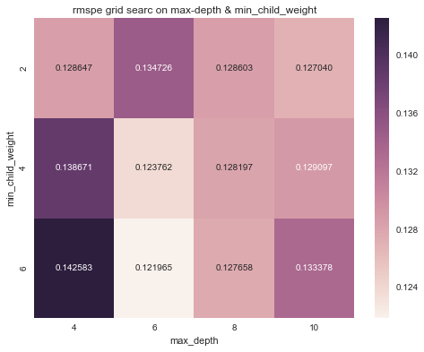 | 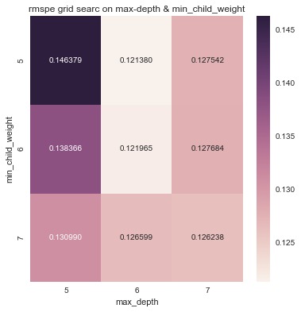 |
  | ---------------------------------------- | ---------------------------------------- |
  | min_child_weight和max_depth以较粗网格进行Grid Search的Heatmap | min_child_weight和max_depth以较细网格进行Grid Search的Heatmap |


- 对subsample和colsample_bytree同时进行优化，优化后subsample选择0.95，colsample_bytree选择0.95；

  - 优化过程仅考虑模型训练效果；
  - 第一次以较粗的网格进行优化，subsample可选范围为0.6,0.7,0.8,0.9，colsample_bytree可选范围为0.6,0.7,0.8,0.9；通过下图发现，subsample=0.9，colsample_bytree=0.7时，模型泛化能力最优，但仍略逊于subsample=0.95，colsample_bytree=0.95时训练得到的模型。因此基于subsample=0.95，colsample_bytree=0.95进一步细分网格。
  - 第二次以较细的网格进行优化，subsample可选范围为0.9,0.95,1.0，colsample_bytree可选范围为0.9,0.95,1.0；通过下表发现，subsample=0.95，colsample_bytree=0.95时，模型泛化能力最优；

  | 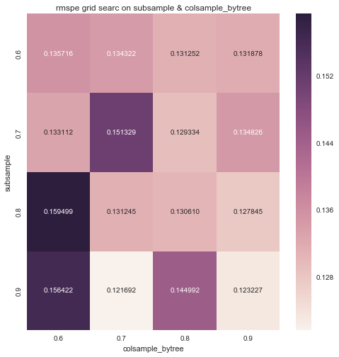 | 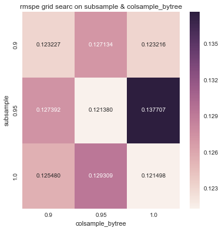 |
  | ---------------------------------------- | ---------------------------------------- |
  | subsample和colsample_bytree以较粗网格进行Grid Search的Heatmap | subsample和colsample_bytree以较细网格进行Grid Search的Heatmap |


- 对学习率eta和提前终止循环次数early_stopping_rounds同时进行优化，优化后eta选择0.1，early_stopping_rounds选择600；

  - 优化过程仅考虑模型训练效果；
  - 第一次以较粗的网格进行优化，eta可选范围为0.1,0.2,0.3，early_stopping_rounds可选范围为$\frac{10}{eta}$、$\frac{20}{eta}$、$\frac{30}{eta}$、$\frac{40}{eta}$；通过下侧左图发现，eta=0.1，early_stopping_rounds=$\frac{40}{eta}$=400时，模型泛化能力最优。
  - 第二次以较细的网格进行优化，eta可选范围为0.05,0.10,0.15，early_stopping_rounds可选范围为266，400，600；通过下表发现，eta=0.10，early_stopping_rounds=600时，模型泛化能力最优；

  | 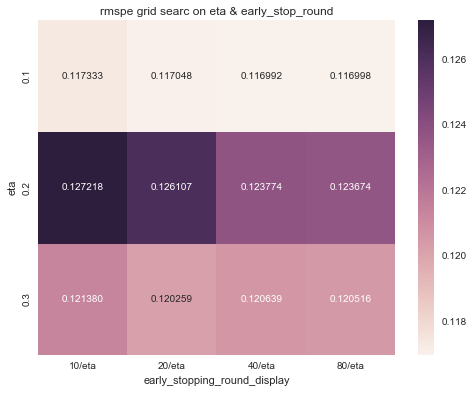 | 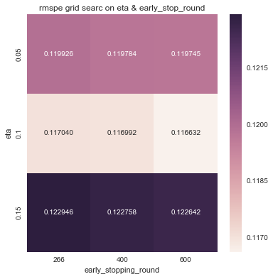 |
  | ---------------------------------------- | ---------------------------------------- |
  | eta和early_stopping_rounds以较粗网格进行Grid Search的Heatmap | eta和early_stopping_rounds以较细网格进行Grid Search的Heatmap |


- 优化后的模型参数汇总如下：


| 参数                            | 初始参数值 |
| ----------------------------- | ----- |
| 学习率eta                        | 0.1   |
| 提前终止循环次数early_stopping_rounds | 600   |
| 模型深度max_depth                 | 6     |
| min_child_weight              | 5     |
| subsample                     | 0.95  |
| colsample_bytree              | 0.95  |

- 使用优化后参数训练模型，训练在9745次训练后终止，此时训练集上的RMSPE为**0.083452**，验证集上的RMSPE为**0.116482**；对验证集进行预测，RMSPE得分为**0.116632**；对测试集进行预测，将预测结果提交到Kaggle，Public Score为**0.11547**(排名1587，约**48.0%**)，Private Score为**0.12153**(排名1075，约**32.5%**)。

## IV. 结果

### 模型的评价与验证

最终模型为XGBoost模型：为了得到最终模型，

- 需要对特征进行选择，对特征数据进行预处理，满足模型训练要求
- 需要对学习率eta、提前终止循环次数early_stopping_rounds、模型深度max_depth、min_child_weight、subsample、colsample_bytree等参数通过Grid Search方法进行优化，以得到最终模型；
- 最终模型参数在参数常见范围内，比较合理；
- 最终模型的对于过拟合的预防，主要通过min_child_weight进行实现的。

通过销售额，最终模型的预测效果可以更加直观的得到衡量，优于基准模型:

- 验证集上实际集的平均值、中位数、求和分别为7144.5，6564.0，327588433.0；
- 基准模型、最终模型的统计数据如下所示，可以发现：预测值与实际值之差绝对值，与实际值之比，基准模型为10.58%，而最终模型为9.16%，下降了1.43%。

| 验证集:预测值与实际值之差的绝对值 | 基准模型       | 最终模型       |
| ----------------- | ---------- | ---------- |
| 平均值               | 756.3      | 625.8      |
| 中位数               | 534.0      | 448.0      |
| 求和                | 34669773.0 | 28799726.0 |

| 验证集：预测值与实际值之差的绝对值/实际值 | 基准模型   | 最终模型  |
| --------------------- | ------ | ----- |
| 平均值                   | 10.58% | 8.79% |
| 中位数                   | 8.14%  | 6.84% |
| 求和                    | 10.58% | 8.79% |

最终模型较为合理，与期待结果一致，在训练集和验证集上的RMSPE为**0.083452**和**0.116482**，测试集的Public Score和Private Score为**0.11547**和**0.12153**。虽然有一定的过拟合，但是泛化能力依然较强，具有不错的鲁棒性。

### 合理性分析

基准模型与最终模型的结果对比如下：

| 结果   | 训练集rmspe | 验证集rmspe | Public Score | Private Score |
| ---- | -------- | -------- | ------------ | ------------- |
| 基准模型 | 0.225588 | 0.140907 | 0.14210      | 0.14976       |
| 最终模型 | 0.083452 | 0.116482 | 0.11547      | 0.12153       |

- 基准模型的训练集rmspe **0.225588**大于验证集rmspe **0.140907**，该模型为欠拟合；
- 最终模型的训练集rmspe **0.083452**略小于验证集rmspe **0.116482**，该模型为过拟合，但是泛化能力依然较强；
- 最终模型对测试集的的Public Score **0.11547**和Private Score **0.12153**分别小于基准模型的Public Score **0.14210**和Private Score **0.14976**，因此对于最终模型，其模型对于数据的学习程度以及泛化能力，都远优于基准模型。

## V. 项目结论
### 结果可视化

- 特征重要性

  XGBoost模型在训练过程中，可以得到不同特征的重要性，重要性前三的特征为Store, DayOfYear和DayOfWeek。

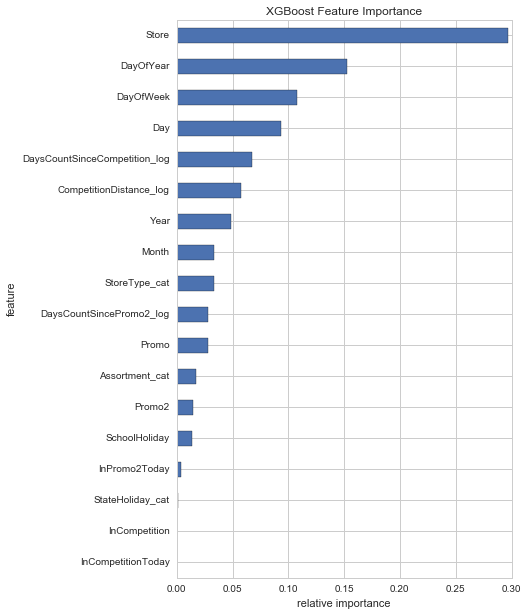

- 使用最终模型对验证集进行预测，将可视化预测误差与实际值之比的绝对值按照日期groupby，对grouby之后数据的均值（下方上图）和标准差（下方下图）进行可视化

  - 对均值数据进行分析：
    - 时间段（2015-06-15到2015-06-29）以及时间段（2015-07-10到2015-07-24）的均值小于0.10，其他时间段会有超过0.10；
    - 虽然均值在开始预测两周后（2016-05-30）开始超过0.1，但是从整个事件段来看，并没有非常明显的显示出随着预测时间越往后，预测误差越大的线性关系。从这可以说明，模型的泛化能力还是不错的。
  - 对标准差数据进行分析：
    - 时间点（2015-07-01，2016-07-05，2016-07-25）的标准差超过0.1，说明模型在这些时间点预测不同药店的结果准确性有较大的波动；
    - 对比均值和标准差结果，均值较小的时间段（小于0.10的区域）其对应的标准差也较小；反之亦然。

  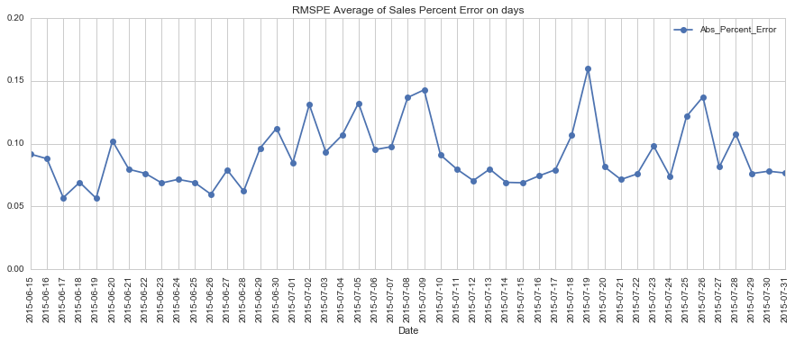

  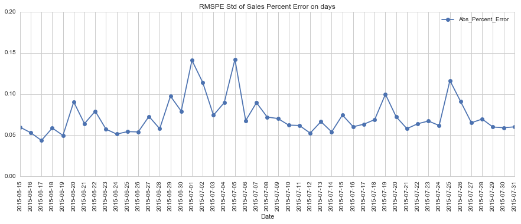

- 使用最终模型对验证集进行预测，将可视化预测误差与实际值之比的绝对值按照药店编号groupby，对grouby之后数据的均值（下方上图）和标准差（下方下图）进行可视化

  - 均值前10的药店编号为：908, 721, 594, 549, 875, 1038, 559, 291, 273, 138
  - 标准差前10的药店编号为：908, 875, 291, 500, 138, 182, 549, 268, 946, 1038；其中6个药店也在均值前10。
  - 94.3%药店(1051/1115)的均值小于0.1。

  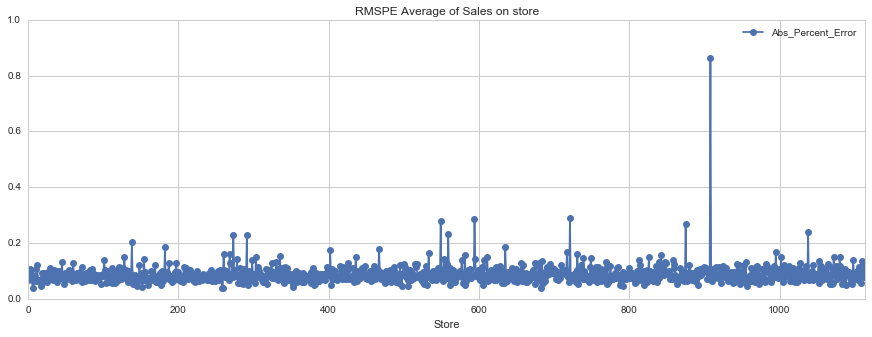

  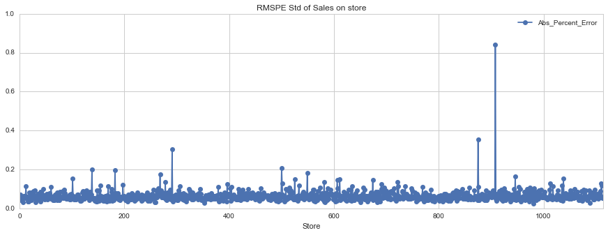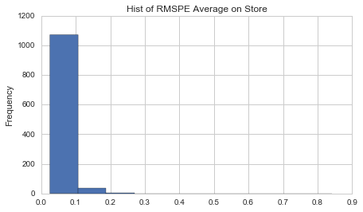


### 对项目的思考

本项目主要实现过程包括：

- 数据探索与可视化
- 选择评价指标与基准模型
- 数据预处理以及训练模型
- 结果与分析

在实现过程中，模型的选择与优化是比较困难的地方：为了训练出学习能力好、泛化能力强的模型，在模型初选阶段，需要对多种模型进行大量尝试；除了项目最后选用的XGBoost方法，本项目还尝试了随机森林、深度学习embedding方法，但是训练出的模型效果相比基准模型进步不大，但是各种方法（尤其是深度学习embedding方法）的实现以及优化是需要较多的知识储备以及模型训练时间；

最终模型采用了Kaggle比赛中针对回归预测类非常通用XGBoost方法，其预测效果也显出了很强的泛化能力，相比基准模型也有很大的提高；此外，本项目的实现方案对于回归预测类问题具有一定的通用性。

### 需要作出的改进

本项目可以从以下方面实现进一步的完善：

- XGBoost模型的集成：既可以使用相同特征、采用不同随机seed训练出XGBoost模型，也可以使用不同特征训练出XGBoost模型，然后对这些模型的结果进行集成；
- 采用深度学习embedding方法进行实现。Kaggle比赛中，第三名[Cheng Guo【5】](https://arxiv.org/pdf/1604.06737.pdf) 将原本主要用于自然语言处理的深度学习entity embedding模型应用到该项目，取得第三名，由此可见该方法的强大之处；
- 使用速度更快的机器训练模型。不管是XGBoost模型，还是深度学习模型，都需要较长的训练过程，为了缩短训练时间，提高模型优化的效率，可以尝试使用带有GPU加速的AWS服务器。
- 分析在验证集上预测误差较大的药店，分析可能的原因，并进行解决。
- 考虑到本项目数据集与时序关系很大， 尝试使用AR、MA、ARMA等方法；
- 尝试使用RNN等与时序有关的深度学习模型；

参考文献：

【1】Kaggle比赛-Rossman Store Sales: https://www.kaggle.com/c/rossmann-store-sales#description
【2】周志华. 机器学习[M]. 北京：清华大学出版社, 2016.
【3】Tianqi Chen. XGBoost- A Scalable Tree Boosting System[J].  arXiv,2016. 
【4】Gert. Winning Model Documentation-describing my solution for the Kaggle competition-“Rossmann Store Sales”.2015. https://kaggle2.blob.core.windows.net/forum-message-attachments/102102/3454/Rossmann_nr1_doc.pdf.
【5】[Cheng Guo.Entity Embeddings of Categorical Variables.[J].  arXiv,2016.]((https://arxiv.org/pdf/1604.06737.pdf)) 	
【6】Arshay Jain.  Complete Guide to Parameter Tuning in XGBoost (with codes in Python). 2016: https://www.analyticsvidhya.com/blog/2016/03/complete-guide-parameter-tuning-xgboost-with-codes-python

